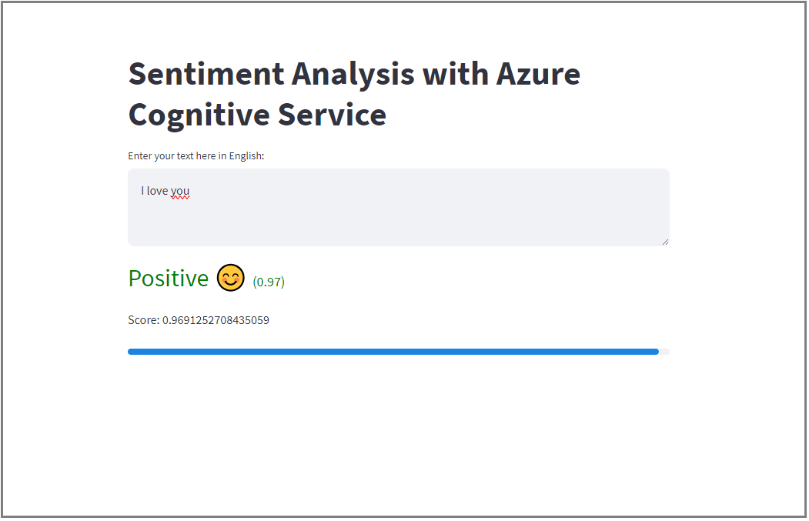

Streamlit NLP
==============================

Example of project using Streamlit and Azure Cognitive Service

Project installation
--------------------

1. create a pyenv environment with pyenv virtualenv system nlp

```
pyenv virtualenv system nlp
```

2. activate your local environment with pyenv activate nlp

```
pyenv activate nlp
```

3. install the requirements with make requirements

```
make requirements
```

4. set your .env file with make set_variable

```
make set_variable
```

5. complete the ``.env`` file with your azure signitive service credentials

6. run the app with make run

```
make run
```

7. (optional) clean your environment with pyenv virtualenv-delete nlp

```
pyenv virtualenv-delete nlp
```

Project installation (with Docker)
----------------------------------

We provide here a ``Dockerfile`` to run this application into a Docker container

1. Pre-requisite: have docker install on your machine

2. Build the docker image using:

```
docker build -t streamlitapp:latest .
```

2. Run the docker container using:

```
docker run -p 8501:8501 streamlitapp:latest
```

Project Demo
------------



Project Organization
--------------------

    ├── LICENSE
    ├── Makefile           <- Makefile with commands like `make data` or `make train`
    ├── README.md          <- The top-level README for developers using this project.
    ├── app
    │   └── app_sentiment.py  <- Data from third party sources.
    │
    ├── data
    │   ├── external       <- Data from third party sources.
    │   ├── interim        <- Intermediate data that has been transformed.
    │   ├── processed      <- The final, canonical data sets for modeling.
    │   └── raw            <- The original, immutable data dump.
    │
    ├── docs               <- A default Sphinx project; see sphinx-doc.org for details
    │
    ├── models             <- Trained and serialized models, model predictions, or model summaries
    │
    ├── notebooks          <- Jupyter notebooks. Naming convention is a number (for ordering),
    │                         the creator's initials, and a short `-` delimited description, e.g.
    │                         `1.0-jqp-initial-data-exploration`.
    │
    ├── references         <- Data dictionaries, manuals, and all other explanatory materials.
    │
    ├── reports            <- Generated analysis as HTML, PDF, LaTeX, etc.
    │   └── figures        <- Generated graphics and figures to be used in reporting
    │
    ├── requirements.txt   <- The requirements file for reproducing the analysis environment, e.g.
    │                         generated with `pip freeze > requirements.txt`
    │
    ├── setup.py           <- makes project pip installable (pip install -e .) so src can be imported
    ├── src                <- Source code for use in this project.
    │   ├── __init__.py    <- Makes src a Python module
    │   │
    │   ├── data           <- Scripts to download or generate data
    │   │   └── make_dataset.py
    │   │
    │   ├── features       <- Scripts to turn raw data into features for modeling
    │   │   └── build_features.py
    │   │
    │   ├── models         <- Scripts to train models and then use trained models to make
    │   │   │                 predictions
    │   │   ├── predict_model.py
    │   │   └── train_model.py
    │   │
    │   └── visualization  <- Scripts to create exploratory and results oriented visualizations
    │       └── visualize.py
    │
    └── tox.ini            <- tox file with settings for running tox; see tox.readthedocs.io


--------

<p><small>Project based on the <a target="_blank" href="https://drivendata.github.io/cookiecutter-data-science/">cookiecutter data science project template</a>. #cookiecutterdatascience</small></p>
